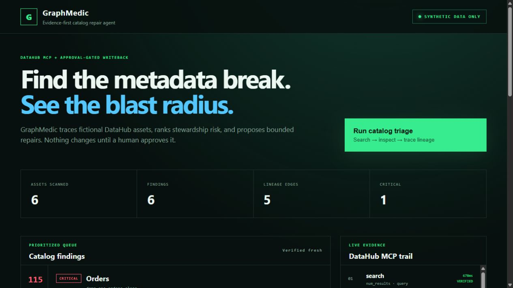
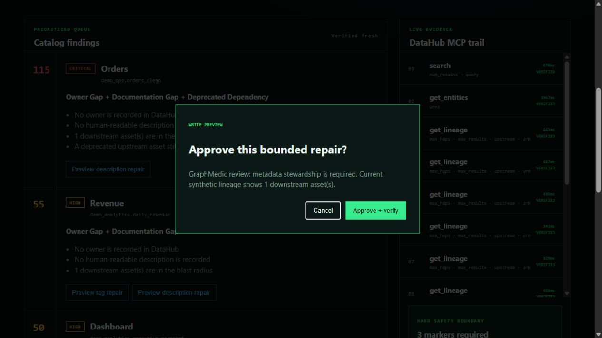

# GraphMedic

GraphMedic is an evidence-first catalog repair agent for DataHub. It searches an explicitly opted-in fictional catalog through DataHub's official MCP server, traces one-hop lineage, ranks metadata risks by blast radius, proposes bounded repairs, and writes only after explicit human approval. Every write is then read back and recorded in a local audit trail.

> **Privacy guarantee:** the repository, screenshots, demo, and seeded catalog use synthetic data only. GraphMedic rejects an asset unless its URN contains `graphmedic_demo`, it carries the `GraphMedicDemo` tag, and its `data_classification` property is exactly `SYNTHETIC`.



## Why it matters

Catalog drift is rarely a single empty field. An undocumented table may feed several downstream assets, or a supposedly retired source may still feed production lineage. GraphMedic turns those relationships into an explainable repair queue instead of asking a steward to manually inspect every record.

## DataHub usage

GraphMedic uses DataHub OSS and the official DataHub MCP server for:

- `search` to discover the opted-in demonstration namespace;
- `get_entities` to verify tags, ownership, descriptions, and the synthetic classification;
- `get_lineage` in both directions to calculate blast radius and detect deprecated dependencies;
- `add_tags` and `update_description` for approval-gated repair;
- a post-write `get_entities` call to verify the change.

The UI displays the MCP trail, argument names, duration, and verification state. Secrets and full payloads never enter that trail.



## Quick start

Prerequisites: Python 3.11+, Docker Desktop, and a local DataHub Core instance. The app expects GMS at `http://127.0.0.1:18080` by default.

```powershell
python -m venv .venv
.\.venv\Scripts\python.exe -m pip install -e ".[datahub,test]"
.\.venv\Scripts\python.exe .\scripts\seed_synthetic_catalog.py
.\.venv\Scripts\graphmedic.exe
```

Open `http://127.0.0.1:8765`. For a Docker-free reviewer preview, set `GRAPHMEDIC_MODE=fixture` before starting the app.

## Verification

```powershell
.\.venv\Scripts\python.exe -m pytest -q
.\.venv\Scripts\python.exe .\scripts\privacy_scan.py
```

The test suite covers risk scoring, the three-marker privacy allowlist, deny-before-network mutation handling, the human approval gate, API behavior, audit recording, and privacy-pattern detection.

## Safety model

GraphMedic is intentionally narrow:

1. Search results are reduced to dataset URNs in the demo namespace.
2. Full entity metadata must independently prove both the demo tag and synthetic classification.
3. The server, not the browser, holds the current reviewed proposals.
4. The browser sends only a finding ID, action kind, and approval flag; it cannot invent a URN or write value.
5. Only the `GraphMedicReviewed` tag and a deterministic `GraphMedic review:` note are permitted.
6. Every write is verified with a fresh read.

See [docs/data-policy.md](docs/data-policy.md) and [docs/architecture.md](docs/architecture.md) for details.

An [interactive, browser-safe reviewer preview](https://bgrubbs1.github.io/datahub-graphmedic/demo/) replays the sanitized MCP evidence. It is clearly labeled as a captured preview; the Python application remains the live DataHub integration.

## License

Apache License 2.0. See [LICENSE](LICENSE).
